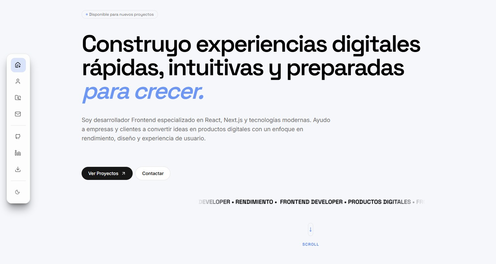

<div align="center">

# ¡Hola! Soy Pablo Zallio 👋

### Frontend Developer

*Interfaces cuidadas, rápidas y con buena experiencia de usuario.*

Este es el repositorio de mi portfolio personal — el sitio donde muestro mis proyectos, mi stack y cómo trabajo como desarrollador.


</div>

---

## Sobre el proyecto

Este repo es mi portfolio personal: un sitio pensado para presentar quién soy como desarrollador, qué he construido y cómo contactarme.

No quería que fuera solo una lista de proyectos con capturas — busqué que se sintiera como un producto real, con navegación fluida, animaciones cuidadas, modo oscuro/claro y un formulario de contacto que funciona de verdad. Le puse el mismo mimo que le pongo a cualquier proyecto de cliente.

## Preview




## Características

- 📱 **Diseño responsive** — optimizado para todos los dispositivos.
- 🌗 **Modo claro y oscuro** — gestionado con `next-themes`
- 🧭 **Sidebar de navegación** — fija y consciente de la sección activa
- 🎬 **Animaciones al hacer scroll** — fade-ins, slide-ups y reveals en stagger
- 🪟 **Modal de proyectos** — vista detallada sin salir de la página
- ✉️ **Formulario de contacto funcional** — validado y conectado para enviar emails de verdad
- 📄 **Descarga de CV** — directo, sin redirecciones raras
- 🔗 **Enlaces a redes** — GitHub y LinkedIn, bien visibles

## Stack tecnológico

**Base**
- [Next.js](https://nextjs.org/) — framework
- [React](https://react.dev/) — librería de UI
- [TypeScript](https://www.typescriptlang.org/) — tipado

**Estilo y UI**
- [Tailwind CSS](https://tailwindcss.com/) — estilos utility-first
- [Framer Motion](https://www.framer.com/motion/) — animaciones
- [Lucide React](https://lucide.dev/) / [React Icons](https://react-icons.github.io/react-icons/) — iconografía
- [next-themes](https://github.com/pacocoursey/next-themes) — cambio de tema

**Formularios y datos**
- [React Hook Form](https://react-hook-form.com/) — gestión y validación de formularios
- [Web3Forms](https://web3forms.com/) — envío de emails, sin backend propio

## Estructura del proyecto

```
app/
├── components/
│   ├── common/      # Componentes compartidos y genéricos usados en toda la app
│   ├── layout/       # Piezas estructurales: sidebar, header, wrappers
│   ├── sections/      # Secciones de la página (hero, proyectos, sobre mí, contacto...)
│   └── ui/           # Piezas de UI pequeñas y reutilizables (botones, badges, inputs)
├── data/             # Contenido estático: info de proyectos, skills, enlaces
├── globals.css       # Estilos globales y variables CSS
├── layout.tsx        # Layout raíz
└── page.tsx          # Punto de entrada
```

Cada carpeta tiene una responsabilidad clara, lo que hace fácil moverse por el proyecto a medida que crece — las secciones se centran en layout y contenido, mientras que `ui/` y `common/` guardan lo que se reutiliza en varios sitios.

## Animaciones

Las animaciones corren con [Framer Motion](https://www.framer.com/motion/) y están puestas con intención, no solo para lucirse:

- **Fade in** al entrar en una sección
- **Slide up** para bloques de contenido según entran en el viewport
- **Stagger** en listas y grids, para que los elementos aparezcan en secuencia y no todos a la vez
- **Animaciones del modal** al abrir y cerrar el detalle de un proyecto
- **Reveals** ligados al scroll

La idea es que el movimiento acompañe, no que distraiga.

## Tema visual

El modo claro y oscuro se gestiona con `next-themes`, combinado con variables CSS personalizadas definidas en `globals.css`. Los componentes usan esas variables en vez de colores fijos, así que todo el sitio cambia de tema de forma consistente, sin parpadeos ni desajustes.

## Formulario de contacto

El formulario está construido con **React Hook Form** para la gestión y validación, y se envía a través de **Web3Forms** — sin necesidad de backend propio. Los errores se gestionan en el cliente antes de enviar nada.

> Este repositorio no incluye ninguna API key ni información sensible.

## Contacto

- **GitHub:** [github.com/Pablo-Zallio-Dev](https://github.com/Pablo-Zallio-Dev)
- **LinkedIn:** [linkedin.com/in/pablozalliodev](https://www.linkedin.com/in/pablozalliodev/)
- **Portfolio:** [https://portfolio-v2-pablo-zdevs-projects.vercel.app/](https://portfolio-v2-pablo-zdevs-projects.vercel.app/)

## Licencia

Este proyecto está bajo licencia [MIT](./LICENSE) — siéntete libre de inspirarte en él, pero por favor no lo publiques como propio tal cual.

---

<div align="center">
<sub>Hecho con cariño por Pablo Zallio</sub>
</div>